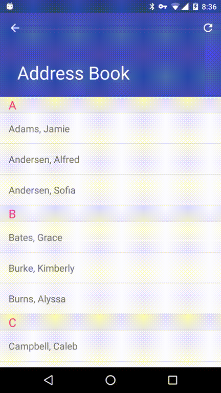
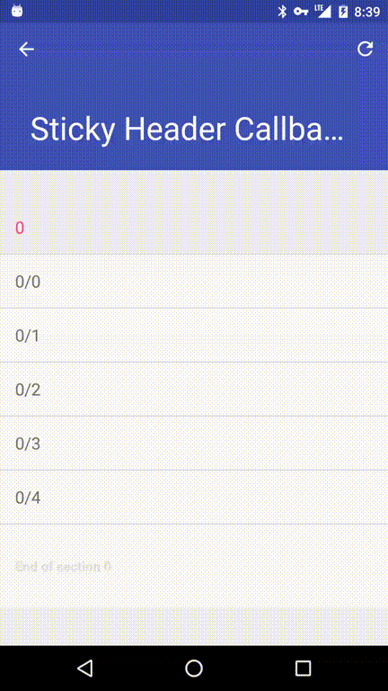

#StickyHeaders
Adapter and LayoutManager for Android RecyclerView which enables sticky header positioning.

---

## Download
minSdkVersion: 11
```
compile 'org.zakariya.stickyheaders:stickyheaders:0.7.3'

```

---

StickyHeaders are section headers in a recyclerview which are positioned "stickily" to the top of the scrollview during scrolling. A common use-case is an address book where the list of people's last names are grouped into sections by the first letter of the last name, and the header for each section shows that letter.

**For example:**



StickyHeaders also supports a callback (`org.zakariya.stickyheaders.StickyHeaderLayoutManager.HeaderPositionChangedCallback`) when a header becomes "sticky" or returns to normal positioning. For example, it is used here to set the elevation on the header to cast a subtle drop shadow when the header is in sticky position.

**For example:**



##Usage

To use StickyHeaders, you need to do two things.

1. Implement an adapter by subclassing `org.zakariya.stickyheaders.SectioningAdapter`
2. Assign a `org.zakariya.stickyheaders.StickyHeaderLayoutManager` to your recyclerview.
3. When handling modifications to your dataset, *never* call the `RecyclerView.Adapter::notify*` methods, instead, call the corresponding methods in `org.zakariya.stickyheaders.SectioningAdapter::notifySection*`. The reason for this is `SectioningAdapter` maintains internal state, and the `notifySection*` methods are tailored for adding and removing sections, adding and removing items from sections, etc.

##Also

You can use sectioning adapter with a normal `android.support.v7.widget.LinearLayoutManager`. it works fine, and could be a good way to implement a list like at the root of Android's Settings app.
